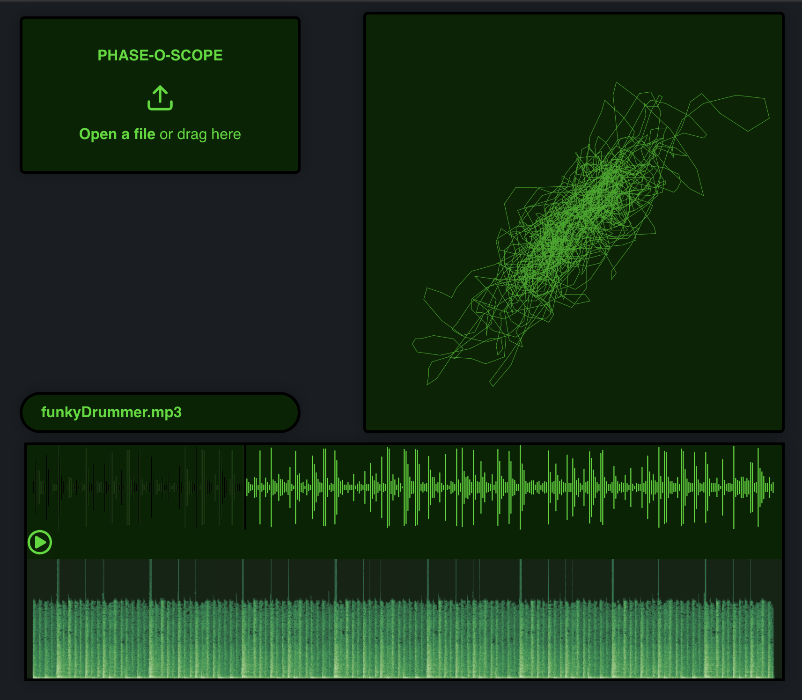
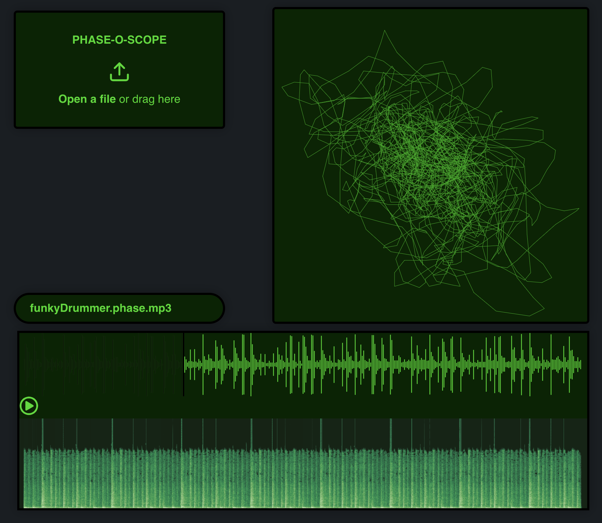

# Phase-o-scope

*Try the [live demo](https://phase-o-scope.netlify.app): load any number of audio tracks into the player, and click a track to play. Or see a quick [YouTube walkthrough](https://youtu.be/Astgn6smLUE).*

Back when I was a full-time broadcaster and spent my evenings in a windowless studio, one source of both fun and useful information was the "phase-o-scope," a single-purpose oscilloscope that worked only in "xy mode", showing the stereo spread of an audio signal by drawing [Lissajous patterns](https://en.wikipedia.org/wiki/Lissajous_curve). 

The pattern for in-phase audio will group roughly around the line y=x (the diagonal line from top right to bottom left of the display), although tracks with a broader stereo signal will deviate more. A pattern oriented around y=-x (top left to bottom right) is a sign of phase cancellation.  
  
<table>
  <tr>
    <td>In-phase audio</td>
     <td>Out-of-phase audio</td>

  </tr>
  <tr>
    <td></td>
    <td></td>
  </tr>
 </table>

The "extreme green" look is a tribute to the glowing green CRT display typical of an old oscilloscope.

Phase-o-scope is an ongoing project written in React.js. The oscilloscope portion is hand-coded using the html Canvas and Web Audio APIs, while the waveform and spectrogram at the bottom of the page use [wavesurfer.js](https://wavesurfer-js.org). 
